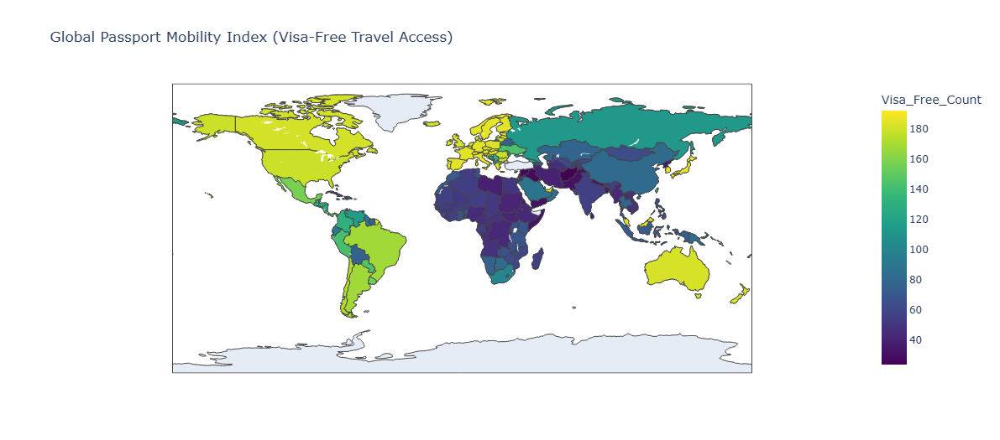

# Global Passport Mobility Index

This project explores inequality in global travel freedom by analysing visa-free access across passports.

## Research Question

How unequal is global mobility across passports?

## Key Insight

The gap in visa-free access between the strongest and weakest passports is **168 countries**.

## Visualisation

### Global Passport Mobility Map

### Strongest vs Weakest Passports

## Tools Used

- Python
- pandas
- matplotlib
- plotly

## Author

Ann-Shirley Coomson  
MSc Data Analytics for Economics and Finance  
University of Glasgow
